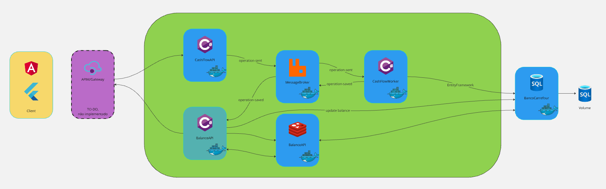

# Teste BancoCarrefour

``` text
# Descritivo da Solução
Um comerciante precisa controlar o seu fluxo de caixa diário com os 
lançamentos (débitos e créditos), também precisa de um relatório que 
disponibilize o saldo diário consolidado.
# Requisitos de negócio
- Serviço que faça o controle de lançamentos
- Serviço do consolidado diário
# Requisitos técnicos obrigatórios
- Desenho da solução
- Pode ser feito na linguagem que você domina
- Testes 
- Boas praticas são bem vindas (Design Patterns, Padrões de Arquitetura, 
SOLID e etc)
- Readme com instruções claras de como a aplicação funciona, e como rodar 
localmente
- Hospedar em repositório publico (GitHub)
*Caso os requisitos técnicos obrigatórios não sejam minimamente 
atendidos, o teste será descartado.*
# Requisitos não funcionais
O serviço de controle de lançamento não deve ficar indisponível se o 
sistema de consolidado diário cair.
Em dias de picos, o serviço de consolidado diário recebe 500 requisições 
por segundos, com no máximo 5% de perda de requisições.
```

## 1 - Desenho técnico



O desafio foi feito em 3 microserviços de **.NET 8**:

- CashFlowAPI:

> CashFlowAPI é resposável por disponibilizar endpoint pro client/Gateway para inserir débtos e > créditos.
> Ao receber os requests, envia para a fila *operations-sent* do RabbitMQ.

- CashFlowWorker:

> CashFlowWorker é subscriber da *operations-sent* e publisher da *operations-saved*
>
> Ao receber mensagem na fila, salva no banco de dados SQL Server.
> Ao salvar no banco, envia para uma nova fila, a *operations-saved*

- BalanceAPI:

> BalancePI disponibiliza o endpoint para consultar o Saldo Consolidado.
>
> Ao receber request do GET /api/balance/, consulta se já existe o saldo no cache do Redis. Caso tenha, já retorna. O Redis está configurado para que o registro fique salvo por 10 minutos.
>
> Caso contrário, envia para o método **RecalculateCurrentDay**, onde resgata os dados do SQL Server, faz o cálculo e já salva no Redis.
>
>
> Também é subscriber da fila *operations-saved*
>
> Ao receber mensagem na fila, roda o **RecalculateCurrentDay**, recalcula e salva no Redis

O projeto também conta com:

- SQL Server

- RabbitMQ

- Redis

Todos estão no Docker, utilizando Docker Compose.

## Para rodar o projeto

Na pasta raiz, rodar o comando
`
docker-compose up --build
`.

Ao baixar as dependências, deverá subir 6 imagens, 3 de microservices .NET, instância do SQL Server, Redis e RabbitMQ.

CashFlowAPI:
> <http://localhost:5286/swagger/index.html>

BalanceAPI:
> <http://localhost:5041/swagger/index.html>

SQL Server:
> No SQL Server Management Studio ou Azure Data Studio:
>
> Server=sqlserver,1433;Database=BancoCarrefour;User ID=sa Password=1q2w3e4r@#$;TrustServerCertificate=True

RabbitMQ:
> <http://localhost:15672/>
>
> User: guest
>
> Password: guest

### Tecnologias

- .NET 8
- MediatR
- EntityFramework Core, Migrations
- SQL Server
- RabbitMq
- Redis
- Docker/docker-compose

### Melhorias, DTs e Known issues

- Kubernetes para orquestrar e fazer o dimensionamento dos serviços
- Transformar em Minimal APIs
- Retirar connectionstrings de hardcoded e receber via appsettings/env via docker
- (CR) UD dos lançamentos. Hoje só cria e lê os registros
- GETs por dia, hoje só pega do dia vigente
- DateTime pega UTC, às vezes se perde quando usa horário local/docker

##### **Não aplicados por falta de tempo e/ou não solicitados como req mínimo*
